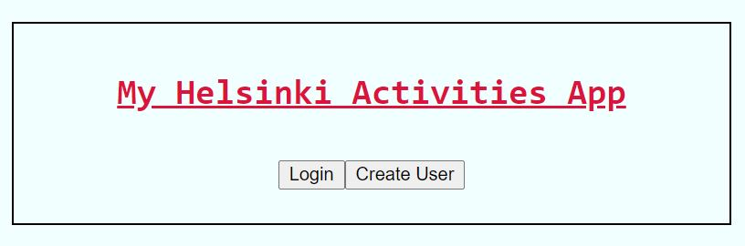
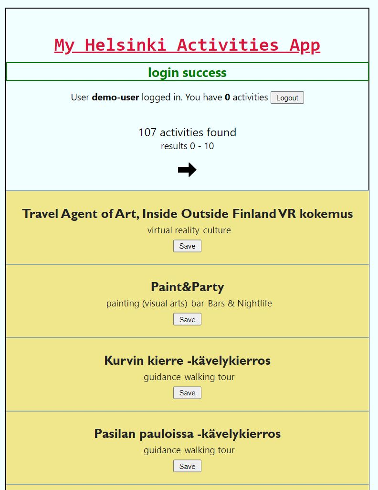
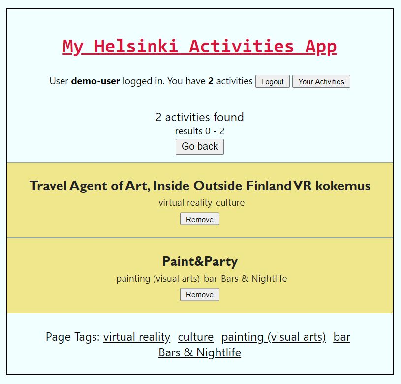
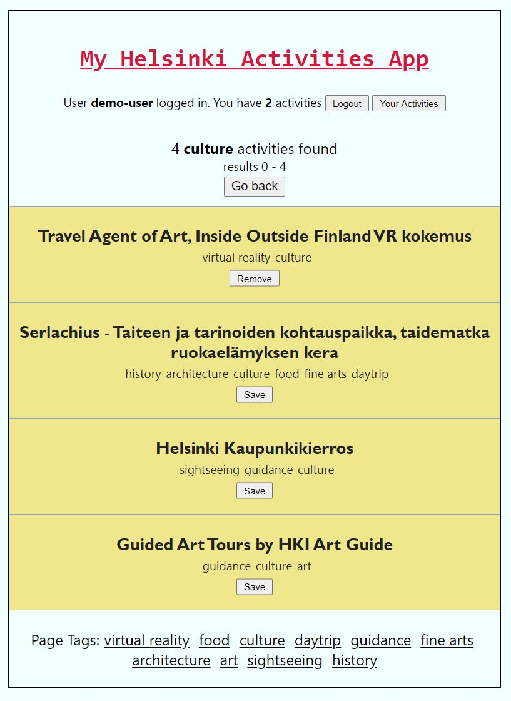
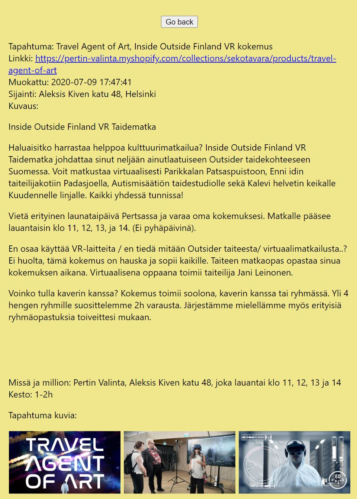

# Description

Web app to display information about activities in Helsinki. 
App uses open data from http://open-api.myhelsinki.fi/ activities database v1activities. 

# Requirements

- Node (version 12.0 used)
- MongoDB (MongDB Atlas used)

## Stack

- MERN-stack

## Tests

- Jest, Supertest

# Installation

/ $ npm install 
environment variables needed /.env.example 
/front/ $ npm install 

# Screenshots

